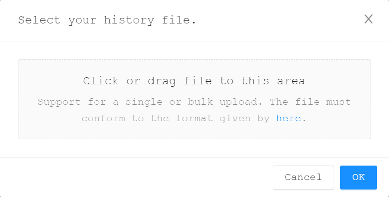

<div style="width:100%;">
    
    <div id="introduction" style="margin-right: 0px">
    	<h1 align="center">mviz🎵</h1>
        <p>
	    A visualization tool for your listening history.
        </p>
    </div>
</div>

## [Online Demo](https://PTYin.github.io/mviz)


## Usage

1. Request a copy of your Spotify listening history by emailing [privacy@spotify.com](mailto://privacy@spotify.com).
   The history file (i.e., `StreamingHistory*.json`) should be something like:
   ```json
    [
      {
        "endTime" : "2019-02-13 06:25",
        "artistName" : "Ludwig van Beethoven",
        "trackName" : "Piano Sonata No. 17 In D Minor, Op. 31, No. 2 -\"The Tempest\": 3. Allegretto - Live",
        "msPlayed" : 5827
      },
      {
        "endTime" : "2019-02-13 06:26",
        "artistName" : "Ludwig van Beethoven",
        "trackName" : "Piano Sonata No. 17 In D Minor, Op. 31, No. 2 -\"The Tempest\": 3. Allegretto - Live",
        "msPlayed" : 2069
      }
    ]
    ```
2. Press the top right button "Analyze your own", and select your own history file. 
3. Wait to all necessary information (e.g., info about related tracks, artists and albums) fetched from [Last.Fm](https://www.last.fm) public API. 


## For Developer

### Last.Fm API Key

1. Create a Last.Fm API account [link](https://www.last.fm/api/account/create)
2. Copy the API Key to `.env` file
   ```text
   REACT_APP_API_KEY=[your-last.fm-api-key]
   ```

### Start

```shell
npm install && npm start
```

